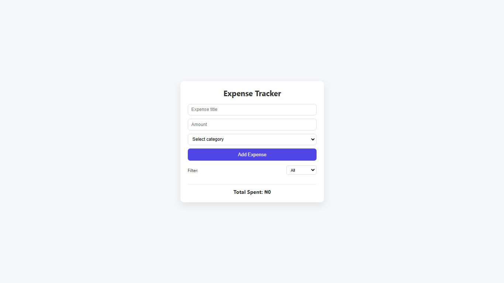

**Expense Tracker App**

A Vanilla JavaScript Expense Tracker built to practice DOM manipulation, state management, and localStorage.

It allows users to add, delete, and filter expenses while dynamically calculating totals in a clean and responsive interface.

Table of contents

Overview

The challenge

Screenshot

Links

My process

Built with

What I learned

Continued development

Author

Overview
The Expense Tracker App allows users to easily manage their personal expenses.

Key features include:

Add an expense with a title, amount, and category

Delete individual expenses using a delete icon

Filter expenses by category

See the total amount update dynamically based on the selected filter

Keep expenses persisted across page refreshes using localStorage

Enjoy a clean and responsive layout across devices
Screenshot

Links

Solution URL: https://github.com/Olaolubayo/Expense-tracker.git

Live Site URL:  https://olaolubayo.github.io/Expense-tracker/

My process
I approached this project by:

Structuring the HTML for clear separation of form, filters, list, and total

Managing all expenses using a single source of truth (expensesArray)

Rendering UI based on application state rather than manipulating DOM directly

Persisting data using localStorage

Implementing filtering and dynamic total calculation using array methods

Built with

Semantic HTML5

CSS3 (Flexbox & responsive layout)

Vanilla JavaScript (ES6+)

What I learned

How to manage application state effectively using arrays

Proper use of Array.filter() for deleting and filtering data

Using Array.reduce() to calculate totals dynamically

Separating concerns between data, UI rendering, and user interactions

Why derived values (like totals) should not be stored separately

Example logic used for total calculation:
const total = expenses.reduce((acc, exp) => acc + exp.amount, 0);

Continued development
In future iterations, I plan to:

Add an edit expense feature

Improve UI with category badges and animations

Implement confirmation before delete

Add monthly summaries and analytics

Improve accessibility and keyboard navigation

Author
Olaolubayo
Frontend Developer

GitHub – Olaolubayo
